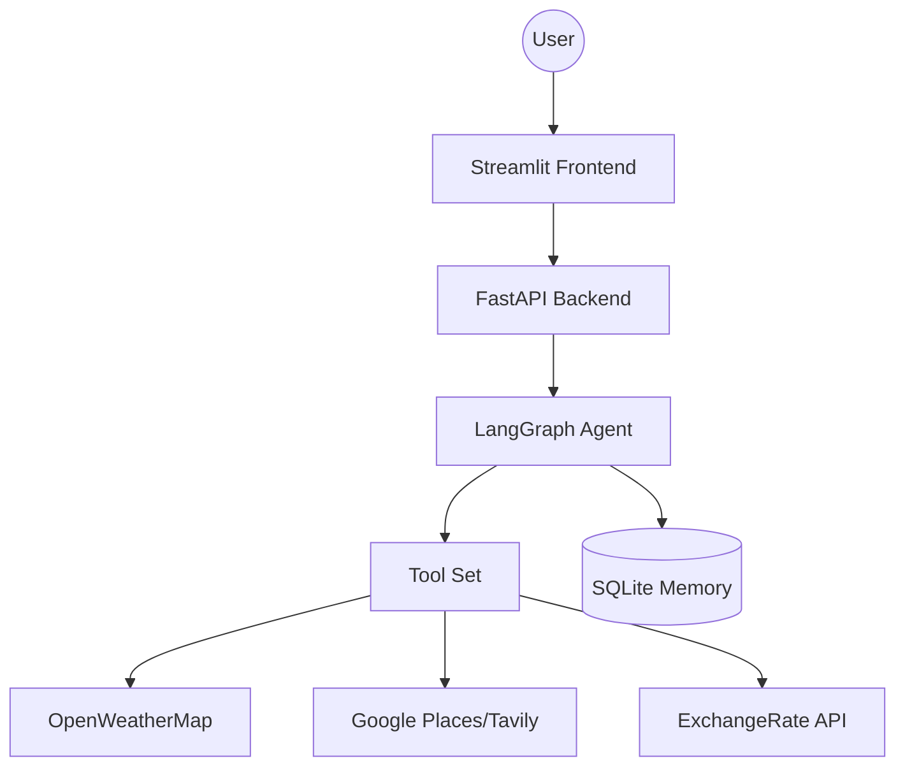

# 🌍 AI Travel Planner - Agentic Workflow

An advanced **AI Travel Agent** designed to plan comprehensive, multi-day itineraries with real-time budget management and context-aware persistence. Built using **LangGraph**, **FastAPI**, and **Streamlit**.

## 🚀 Key Features

*   **Agentic Logic**: Built on **LangGraph** for sophisticated state management and complex tool-calling workflows.
*   **Production Engineering**: Includes robust **logging** and centralized **exception handling** for professional-grade reliability.
*   **Multi-Turn Memory**: Uses **SQLite Persistence** to maintain conversation context across multiple user requests.
*   **Rich Tool Suite**:
    *   **Weather Info**: Real-time forecasts for plan optimization.
    *   **Google Places/Tavily**: Intelligent POI and restaurant discovery.
    *   **Arithmetic & Expense**: Automated budget breakdown and cost calculations.
    *   **Currency Conversion**: Real-time exchange rate calculations.

## 🏗️ Architecture



## 🛠️ Setup & Installation

1.  **Clone the Repository**:
    ```bash
    git clone <your-repo-link>
    cd AI_Trip_Planner
    ```

2.  **Environment Configuration**:
    Rename `.env.name` to `.env` and provide your API keys:
    *   `GROQ_API_KEY` (Required for LLM)
    *   `TAVILY_API_KEY` (Required for Search)
    *   `OPENWEATHERMAP_API_KEY` (Optional for Weather)

3.  **Install Dependencies**:
    ```bash
    python -m venv venv
    .\venv\Scripts\activate
    pip install -r requirements.txt
    pip install -e .
    ```

## 🏃 Running the Application

1.  **Start the Backend**:
    ```bash
    uvicorn main:app --reload --port 8000
    ```
2.  **Start the Frontend**:
    ```bash
    streamlit run streamlit_app.py
    ```

## 🧪 Testing

To ensure the reliability of the tools and graph initialization:
```bash
pytest tests/test_tools.py
pytest tests/test_graph.py
```

## 📝 Engineering Standards

*   **Logs**: Stored in the `logs/` directory with detailed timestamps and line numbers.
*   **Exceptions**: Custom `TravelPlannerException` class for uniform error messages across the stack.